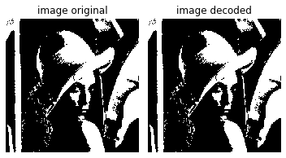

demo_run_length_compression.py

This demo shows how to do Run-Length encoding/decoding of binary images

**Dummy dataset** 

256 x 256 binary image  
(left) Original image, (right) decoded image

  

**Result**  
Encoding for N1 = 256: 8 [bits / symbol]
Encoding for N2 = 256: 8 [bits / symbol]
Encoding for T (transpose): 1 [bits / symbol]
Encoding for S (start image value): 1 [bits / symbol]
Encoding for n; max(n) = 151: 8 [bits / symbol]

Size of the original file: 8192 [bytes]
Size of the encoded file: 3765 [bytes]
Compression ratio:  2.17583

SUCCESS. The original and decoded versions are identical!
